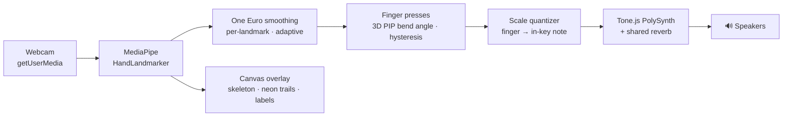

# Airwaves 🎵✋

**A real-time, on-device musical instrument you play with hand gestures — computer vision + audio DSP, 100% in the browser.**

Your webcam tracks your hands 21 landmarks at a time; your 8 non-thumb fingers become piano keys in the air. Lightly curl a finger to sound its note, curl several for a chord, and in slide mode move your hands along an on-screen strip to reach the whole scale — like repositioning your hands on a piano. No controller, no MIDI keyboard — just fingers.

> 🎬 *Demo GIF goes here*
>
> ``

**Live demo:** *(link goes here)*

## Why it's interesting (the hard parts)

- **Real-time hand-landmark tracking** — MediaPipe `HandLandmarker` in `VIDEO` mode, running fully on-device at camera frame rate, with aspect-correct mapping between the camera frame and the cover-cropped viewport.
- **One Euro filtering + joint-angle gestures** — landmarks are smoothed with an adaptive One Euro filter, and finger presses are detected from the 3D bend angle at each finger's middle knuckle with hysteresis, so a light curl triggers reliably and hand tilt doesn't false-fire.
- **Musical quantization** — fingers map to notes of a musical scale (major pentatonic by default), so it always sounds good — there are no wrong notes.
- **Low-latency Web Audio synthesis** — Tone.js voices with short `rampTo` glides and click-free envelopes; end-to-end gesture→sound latency feels instant.
- **Privacy by construction** — everything runs client-side, and Pause fully releases the camera. The feed never leaves your device. No backend, no API keys, no analytics.

## Features

- **Two play modes** — *Finger keys*: 8 fingers = 8 fixed keys in piano layout (left pinky lowest → right pinky highest). *Finger slide*: each hand carries a 4-key window that follows its position along the strip — the window freezes while notes are held, and both hands together reach the entire scale.
- **Always-on scale strip** — a lane bar shows every note of the current scale, highlights each hand's reachable window, and lights up what's sounding.
- **Interactive tutorial** — skippable walkthrough that watches your real fingers and checks off each step as you perform it.
- **Six guided songs** — Happy Birthday, Twinkle Twinkle, Mary Had a Little Lamb, Ode to Joy, Row Row Row Your Boat, Jingle Bells. The strip shows the next note; playing it advances the song, and hits flash.
- **Scale, root & octave** — major/minor pentatonic, major, whole tone; any root; C2–C5.
- **Clip recording** — records webcam + skeleton overlay + synth audio into a downloadable `.webm`, watermark included.
- **Neon trails** — a fading glow ribbon follows every playing fingertip (respects `prefers-reduced-motion`).
- **Pause that means it** — pausing stops the camera entirely; the light goes off.

## Architecture



## Engineering notes

The decisions worth explaining, and the approaches they replaced:

- **Finger presses from a 3D bend angle, not fingertip distance.** The first version fired a note from how close a fingertip was to the wrist. That collapses when the hand tilts, and it forced you to fully close each finger. Presses are now the 3D angle at each finger's middle knuckle (PIP) with on/off hysteresis — a *light* curl registers, hand tilt doesn't false-fire, and the threshold is orientation-invariant.
- **One Euro filter over a fixed-alpha EMA.** Raw landmarks jitter enough to make a held note flicker, but a heavy EMA adds lag you feel as latency. One Euro adapts its cutoff to hand speed — heavy smoothing at rest, light in motion — exactly the jitter-vs-lag trade an instrument needs, and cheap enough to run on all 21 landmarks × 3 axes per frame.
- **Cover-crop coordinate mapping.** The video is shown with `object-fit: cover` (a center crop), but landmarks are normalized to the *full* camera frame, so a naive overlay drifts off the hand at mismatched aspect ratios. A dedicated mapper reverses the crop and the mirror so the skeleton stays glued to the hand at any window/camera size.
- **Slide-mode edge reach.** In slide mode each hand's 4-key window follows its position — but mapping the palm across the *whole* frame meant the extreme notes were only reachable with the hand jammed against the screen edge, exactly where the outer fingers leave the frame and stop tracking. Only the central band of the frame drives the full range now, so every finger stays in view.
- **Canvas performance: no per-frame `shadowBlur`.** A neon glow via `shadowBlur` on ~120 trail segments plus 21 joints per hand tanked the frame rate. It's now layered strokes and fills — a wide translucent halo under a bright core — with device-pixel-ratio capped at 1.5: same look, a fraction of the cost.
- **Considered and cut.** A keyboard "no camera" mode was dropped — this is a camera-first instrument, so a visitor without a webcam isn't a real user. Continuous pitch-bend from hand depth was rejected too: MediaPipe's `z` is noisy, and detuning would fight the "no wrong notes" guarantee.

The gnarly bits above — the mapper, the slide window, the bend angle, the One Euro filter — are pulled into pure, DOM-free modules and covered by unit tests in [`test/`](test).

## Stack

- **Vite** (vanilla JS, ES modules) — no framework, kept deliberately light
- **@mediapipe/tasks-vision** `0.10.14` — hand landmark detection (WASM, GPU delegate)
- **Tone.js** — synthesis, envelopes, reverb on top of Web Audio

## Run it

```bash
npm install
npm run dev    # start the dev server
npm test       # run the unit test suite (Vitest)
npm run build  # emit a static dist/
```

Open the printed localhost URL in **Chrome** (desktop recommended), click **Start playing**, allow camera access, then lightly curl your fingers to play.

> `getUserMedia` requires a secure context — localhost works in dev; use any HTTPS static host (Vercel, GitHub Pages) in production. `npm run build` outputs a fully static `dist/`.

## How to play

| Gesture | Effect |
|---------|--------|
| Lightly curl a finger | Sounds that finger's note (straighten to stop) |
| Curl several fingers | Chord |
| Raise / lower hand | Note velocity |
| Move hand left ↔ right (slide mode) | Repositions that hand's 4-key window along the scale |

Scale, root note, octave, mode, and songs live in the dock; `Space` toggles pause.

## Project structure

```
src/
  main.js       # conductor: session lifecycle + per-frame loop
  hands.js      # HandLandmarker, per-hand smoothing, bend-angle finger presses
  one-euro.js   # adaptive One Euro smoothing filter (pure, tested)
  geometry.js   # pure math: cover-crop mapper, slide window, joint angle (tested)
  audio.js      # Tone.js polyphonic voice bank + reverb + meter
  scales.js     # scale definitions + note/frequency helpers (tested)
  draw.js       # canvas overlay: mirrored skeleton, glow, labels
  trails.js     # neon glow trails following playing fingertips
  strip.js      # always-on scale strip (playing / target / window lanes)
  tutorial.js   # interactive, gesture-checked tutorial steps
  songs.js      # six guided songs + hit-registration logic (tested)
  recorder.js   # canvas+audio compositing to a watermarked .webm
  style.css     # "Air" visual system — sky canvas + frosted glass
test/           # Vitest unit tests for the pure modules above
```

---

Built by **Shreyaan Datta**.
